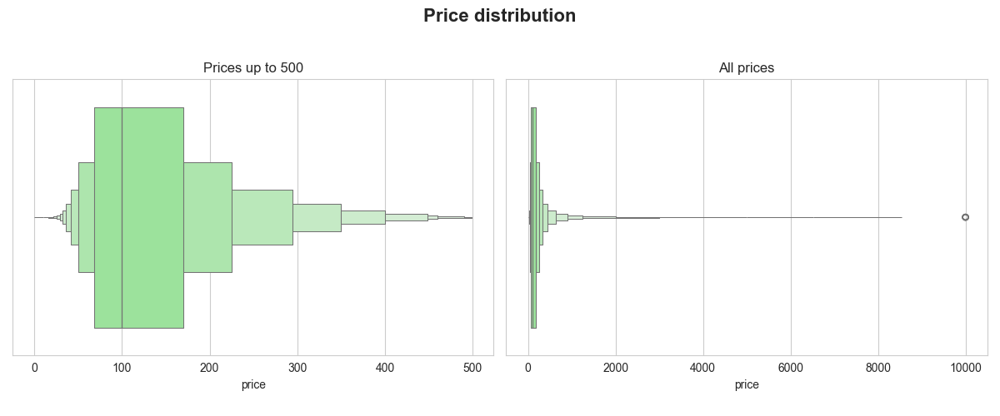
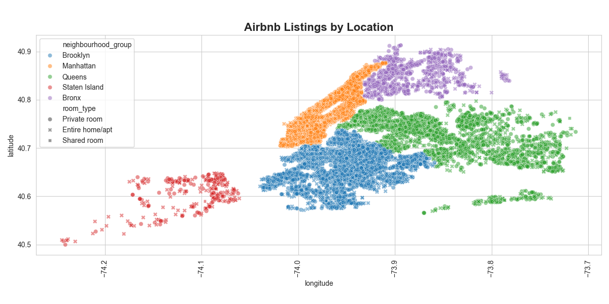

# Airbnb NYC Data Analysis

# NYC Airbnb Data Analysis

Analytical mini-project completed in preparation for employment as a Data Scientist.

## Project structure

- `data/AB_NYC_2019.csv` — initial dataset
- `notebooks/EDA.ipynb` — exploratory data analysis in Pandas + visualizations
- `SQL/queries.sql` — SQL queries for analysis
- `plots/` — saved graphs from EDA
- `README.md` — project description

## Goal

Analyze the short-term rental market in New York:
- explore price distribution
- identify active areas and housing types
- build visualizations
- practice writing SQL queries

## Technologies used

- Python: `Pandas`, `Matplotlib`, `Seaborn`
- SQL (SQLite)
- Git + GitHub
- Jupyter Notebook

## Examples graphs

## Conclusions

- Most listings are in Manhattan and Brooklyn
- Most prices are under $500
- The most expensive properties do not always have many reviews
- Manhattan is the most expensive area by average price

## Data

Dataset: [Airbnb NYC (Kaggle)](https://www.kaggle.com/datasets/dgomonov/new-york-city-airbnb-open-data)

______________________________________________________________________________________________________

# NYC Airbnb Data Analysis

Аналитический мини-проект, выполненный в рамках подготовки к трудоустройству на позицию Data Scientist.

## Структура проекта

- `data/AB_NYC_2019.csv` — исходный датасет
- `notebooks/EDA.ipynb` — исследовательский анализ данных в Pandas + визуализации
- `SQL/queries.sql` — SQL-запросы для анализа
- `plots/` — сохранённые графики из EDA
- `README.md` — описание проекта

## Цель

Проанализировать рынок краткосрочной аренды в Нью-Йорке:
- исследовать распределение цен
- определить активные районы и типы жилья
- построить визуализации
- потренироваться в написании SQL-запросов

## Используемые технологии

- Python: `Pandas`, `Matplotlib`, `Seaborn`
- SQL (SQLite)
- Git + GitHub
- Jupyter Notebook

## Примеры графиков

## Выводы

- Больше всего объявлений — в Манхэттене и Бруклине
- Основная масса цен — до $500
- Самые дорогие объекты не всегда имеют много отзывов
- Manhattan — самый дорогой район по средней цене

## Данные

Датасет: [Airbnb NYC (Kaggle)](https://www.kaggle.com/datasets/dgomonov/new-york-city-airbnb-open-data)

